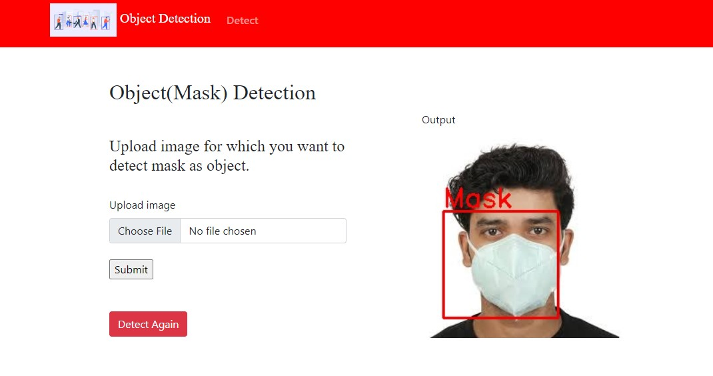
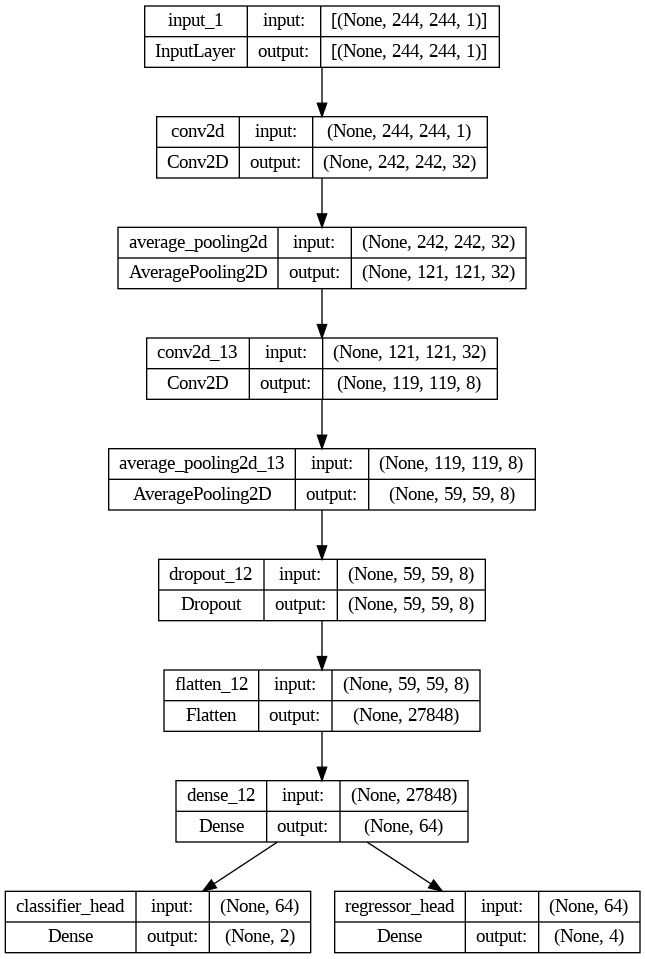
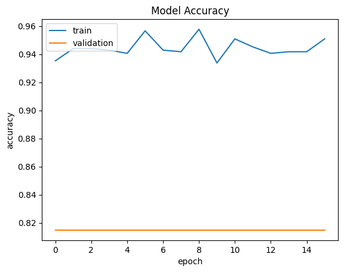
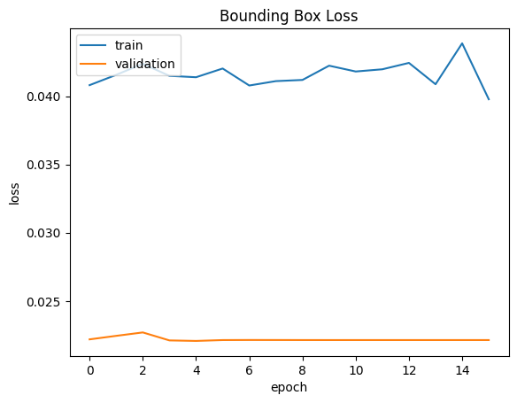
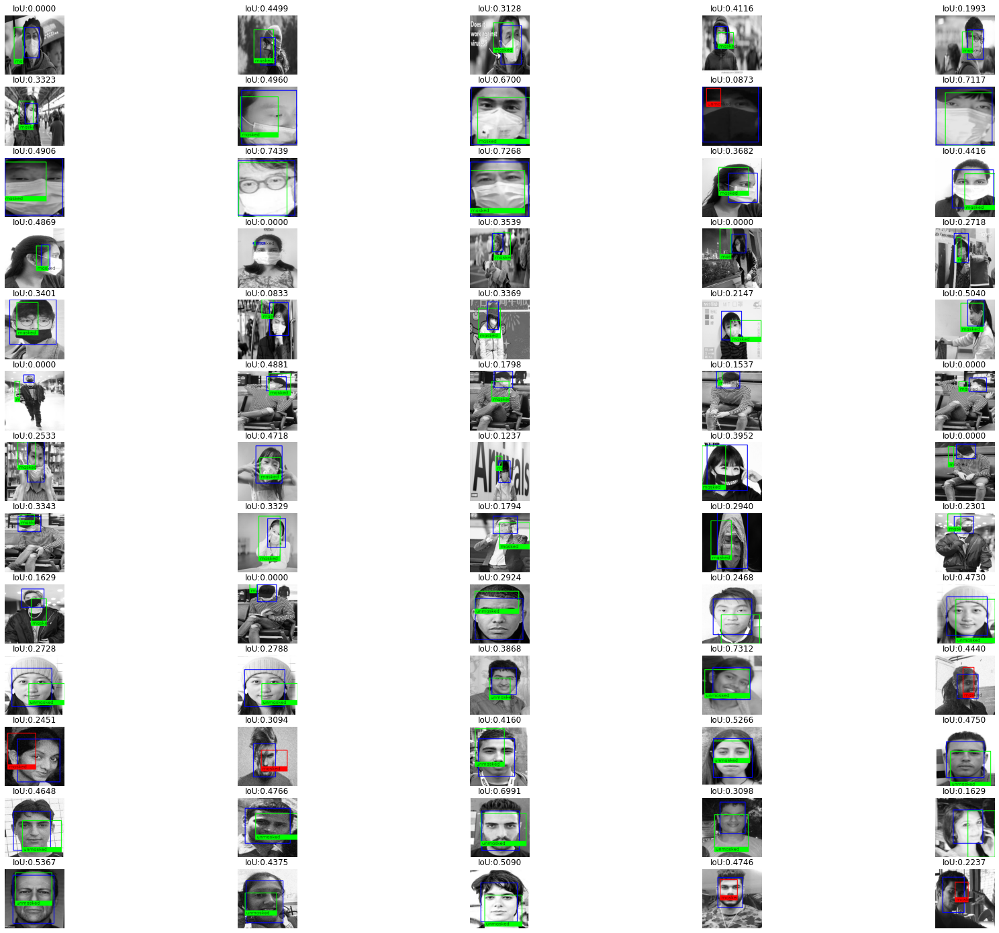

# Object Detection   

## Description   
Detecting whether a person is wearing a face mask or not and pointing out the exact location of face/mask using object detection capabilities of custom CNN architecture. The model is deployed on Flask web application.

## Flask Application



## How to run   
1. Install dependencies
   
`git clone https://github.com/PuroshotamSingh/Object-Detection.git`

`cd Object-Detection` 

`pip install -r requirements.txt`

2. To run training code use `simple_obj_detector2.ipynb` notebook.

3. To run Flask app, follow below instructions:
   
`cd app_backend`

`python app.py`

## Model Architecture

The CNN model architecture constructed for this use case is shown in the image below.



## Model Output

Model Accuracy



Bounding Box Loss



Test Images ouput



## Evaluation Metric

1. IOU (Intersection Over Union)
   ```
   IoU scores how well the predicted bound box overlaps the actual bound box. The idea behind IoU is pretty simple: compare the          intersection and union areas between the predicted and actual bound boxes by dividing the intersection by the union, as shown in the following image:
   ```
   
   
4. Precision
5. Recall
